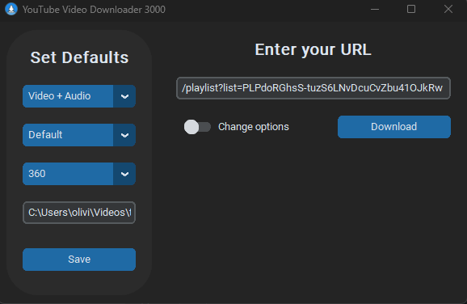
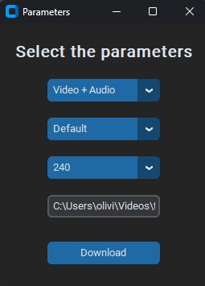

# Youtue Video Downloader 3000

Link specification: 

Simple youtube video URL will download the video.

Link to a video within a playlist - will download full playlist.

Link to a playlist will download the playlist.

If you don't specify the Download Options, it will be downloaded by it's defaults, in to your "Downloads" folder.

By Selecting "Video + Audio", you can get the original video, or you can select "Video" - with no audio, or "Audio" - with no video.

Your settings will be saved in a XML document, so you can download a video multiple times, without specifying the properties each time, or you can switch the radio button, to set other properties.

If a video is not getting downloaded, ensure that the resolution you selected is not too low, and it is actually available for that video.